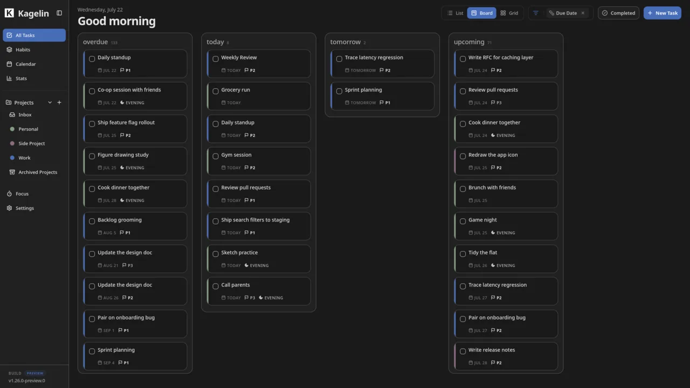
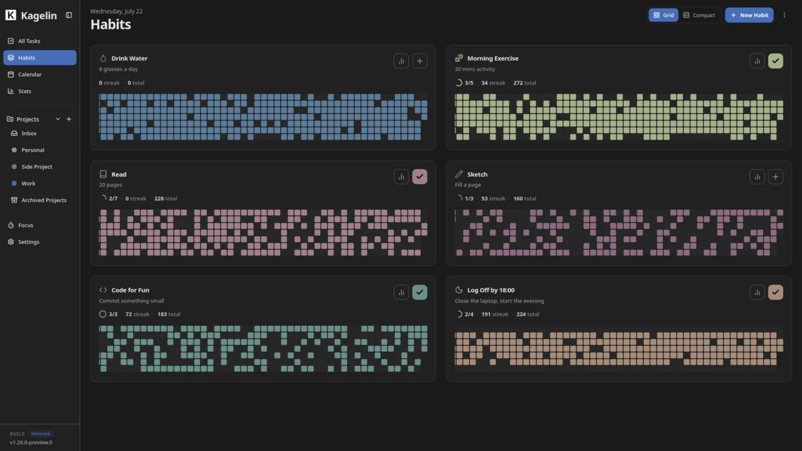
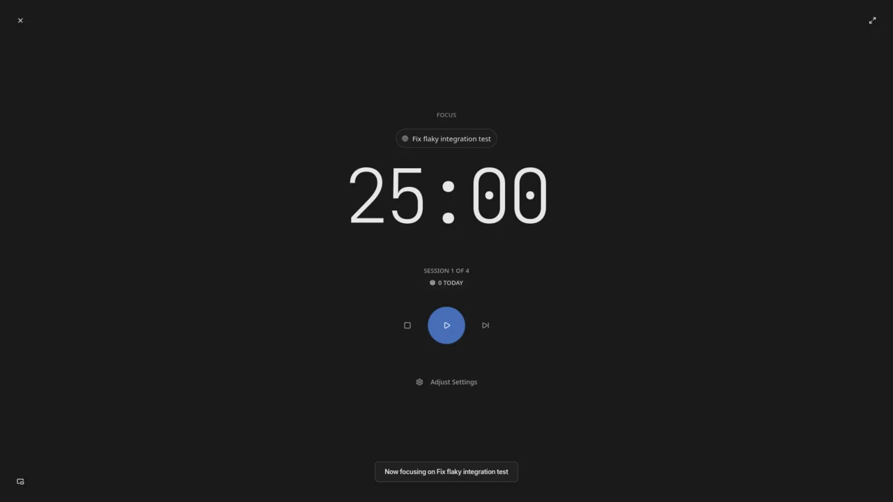
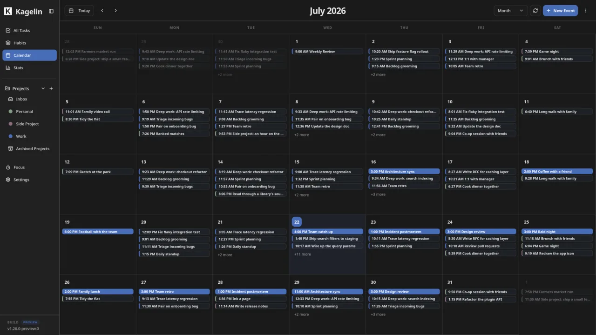
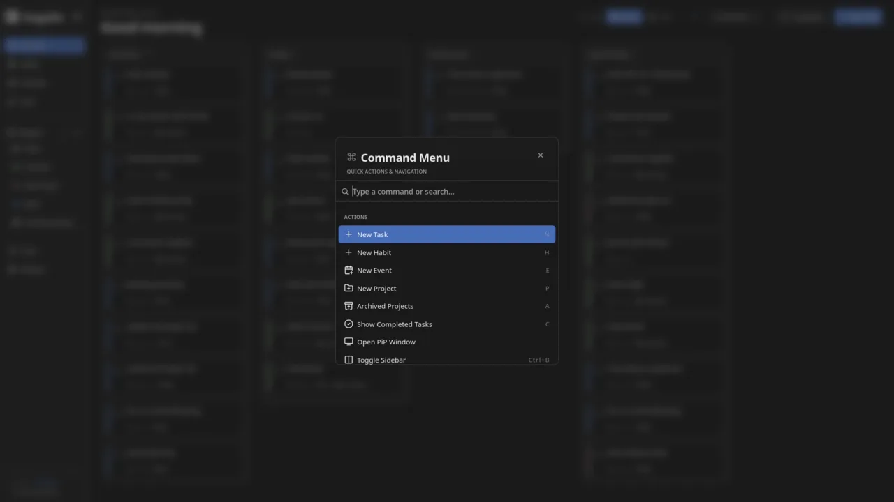

<p align="center">
  <a href="https://kagelin.app">
    
  </a>
</p>

<div align="center">

# Kagelin

### Work quietly. Own everything.

[](LICENSE)
[](../../actions/workflows/ci.yml)
[](https://kagelin.app)

[](../../releases)
[](../../releases)

## Use it

**[kagelin.app](https://kagelin.app)** — installable as a PWA, works fully offline in guest mode. No account needed.

_Currently in preview — expect rough edges._

</div>

## Screenshots

<table>
  <tr>
    <td width="50%"><br /><sub>Board view</sub></td>
    <td width="50%"><br /><sub>Habit grid</sub></td>
  </tr>
  <tr>
    <td width="50%"><br /><sub>Focus timer</sub></td>
    <td width="50%"><br /><sub>Calendar</sub></td>
  </tr>
</table>

<p align="center"><br /><sub>Command palette (Ctrl/Cmd+K)</sub></p>

## Why Kagelin

Most productivity apps want your email before you've written a single task, and keep your data on their servers either way. Kagelin doesn't.

- **Nothing to sign up for.** Tasks, habits, focus, and calendar — all offline in guest mode. Account only if you want cloud sync.
- **Your data, your server.** Point it at Nextcloud, Synology, or any WebDAV server. No middleman.
- **Take everything with you.** Encrypted ZIP export, full data deletion, and standard `.ics` files. Leaving is always an option.

## Features

### Tasks & Organization

- **Search** (`Ctrl/Cmd+K`): instant search across tasks, habits, and events, plus navigation and actions.
- **Three views**: Masonry Grid, Board, and List — switch with `Shift+1/2/3`.
- **Split View**: Desktop List opens a master-detail panel automatically.
- **Projects**: multi-level project structure with archiving and mobile drawers.
- **Group & Filter**: group by project, priority, or due date with drag-and-drop across groups.
- **Recurring tasks**: per-task Strict (anchors to due date) or Flexible (anchors to completion) recurrence.
- **Notes editor**: markdown formatting toolbar with live preview for task notes.

### Focus & Habits

- **Focus Timer**: PiP-enabled Pomodoro engine with real-time sync across devices.
- **Habit tracking**: standardized tracking with longevity streaks and uhabits `.db` import.
- **Compact habit view**: tappable rolling-7 day strip with drag-and-drop reordering.
- **Activity heatmap**: visualize focus minutes and habit completions over time.

### Calendar

- **Event creation**: native calendar events with NLP-assisted time parsing.
- **Multi-provider sync**: Google Calendar and Microsoft Outlook.
- **ICS portability**: universal `.ics` (RFC 5545) import and export.

> CalDAV (Nextcloud, iCloud) is on pause for now — the old connect flow was half-built and didn't handle credentials carefully enough, so it's pulled until it's rebuilt properly server-side.

### Data Ownership

- **Guest Mode**: full-featured, zero-footprint experience in `localStorage` — no account needed.
- **WebDAV sync**: registered users can sync with personal servers (Nextcloud, Synology). Credentials are session-only for now — not yet persisted.
- **Backups**: encrypted `.zip` export/import for everyone, guest or registered. Registered users can also permanently delete all cloud data.
- **Offline-first PWA**: full offline support via service worker with stale-while-revalidate caching.

### Stats & Insights

- **Stats page**: period selector, breakdowns by project and priority, time-of-day heatmap.
- **Item insights**: per-habit and per-recurring-task stats — score history, streaks, frequency, on-time rate.
- **Goal tracking**: progress rings on habit cards, global focus and task goals.
- **Export**: analytics CSV and JSON from stats and insights panels.

### Preferences

- **Time format**: system-wide 12h/24h toggle across all time displays.
- **Keyboard accessible**: Esc closes all modals, full focus-trap and `aria-modal` compliance.
- **Haptic feedback**: standardized haptic palette for precise mobile feedback.

## Shortcuts

| Shortcut          | Action                                                            |
| ----------------- | ----------------------------------------------------------------- |
| `1–6`             | Quick navigation (Home, Habits, Calendar, Stats, Focus, Settings) |
| `Shift+1 / 2 / 3` | Switch view (Grid / Board / List)                                 |
| `Ctrl/Cmd+K`      | Open Command Palette                                              |
| `Ctrl/Cmd+B`      | Toggle Sidebar                                                    |
| `N / H / E / P`   | Create new (Task, Habit, Event, Project)                          |
| `Shift+H`         | View all shortcuts                                                |

<details>
<summary><strong>Stack</strong></summary>

- **Next.js 16.2.10** (App Router) + **React 19.2.3** (React Compiler)
- **Supabase** (Postgres, Auth, Realtime)
- **TanStack Query v5** (IndexedDB persistence) + **Zustand v5**
- **Tailwind CSS v4** + **Shadcn UI** (Radix)
- **Framer Motion** + **@dnd-kit** (flat-DOM drag-and-drop)
- **Serwist** (typed service worker, offline-first PWA)
- **tsdav** (WebDAV sync) + **ical.js** (ICS import/export)

</details>

## Setup

**Prerequisites**: Node.js 20+, a Supabase project with the schema from `supabase/schema.sql` and relevant migrations from `supabase/migrations`.

```bash
git clone https://github.com/Achyuth072/Kanso.git
npm install
cp .env.example .env.local   # add all relevant keys
npm run dev
```

## Contributing & Feedback

Bug reports and feature requests go in [GitHub Issues](../../issues). For questions and discussion, use [GitHub Discussions](../../discussions).

## License

[AGPL-3.0](LICENSE)
