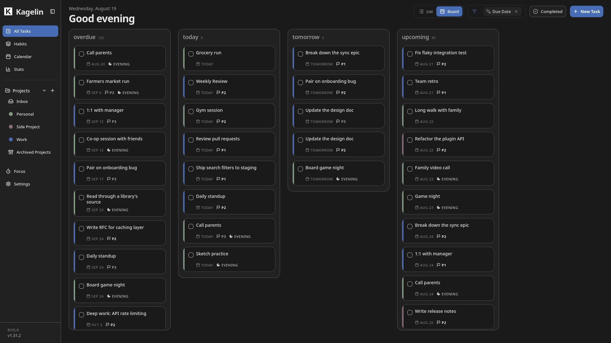
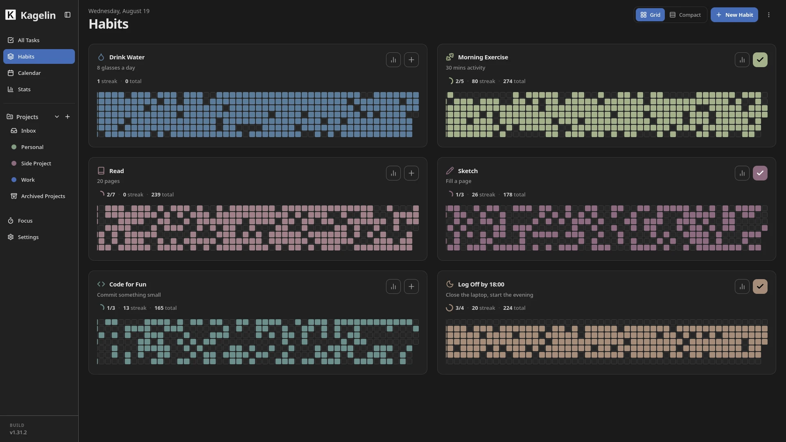
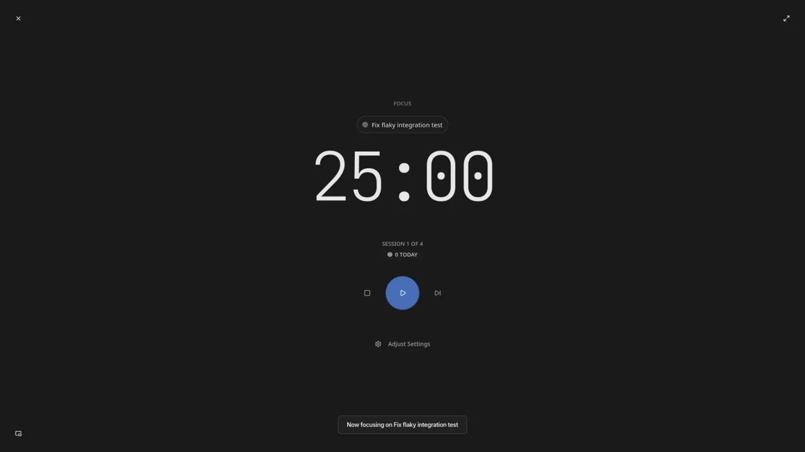
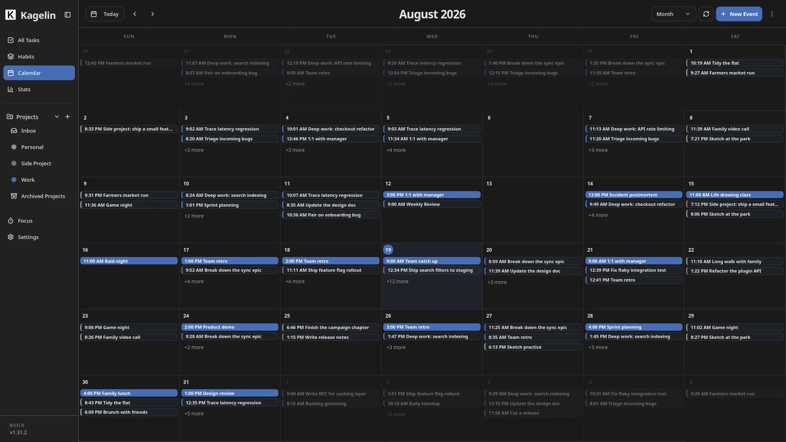
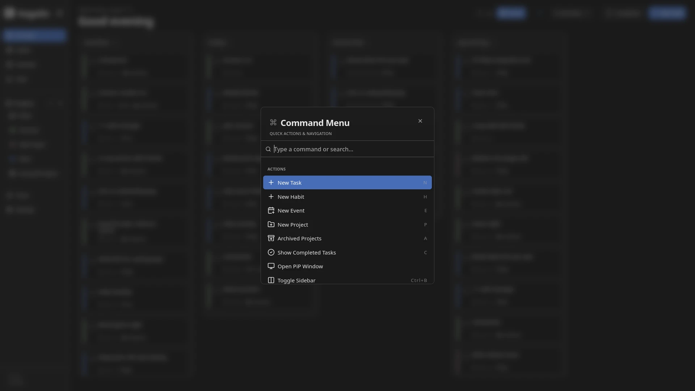

<p align="center">
  <a href="https://kagelin.app">
    
  </a>
</p>

<div align="center">

# Kagelin

## Work quietly. Own everything

[](LICENSE)
[](../../actions/workflows/ci.yml)
[](https://kagelin.app)

[](../../releases)
[](../../releases)

[](https://github.com/sponsors/Achyuth072)
[](https://ko-fi.com/oneakira)

## Use it

**[app.kagelin.app](https://app.kagelin.app)** — installable as a PWA, works fully offline in guest mode. No account needed.

_Currently in preview — expect rough edges._

</div>

## Screenshots

<p align="center">
  
  &nbsp;
  
</p>
<p align="center">
  
  &nbsp;
  
</p>
<p align="center">
  <br />
  <sub>Command palette (Ctrl/Cmd+K)</sub>
</p>

## Why Kagelin

Most productivity apps want your email before you've written a single task, and keep your data on their servers either way. Kagelin doesn't.

- **Nothing to sign up for.** Tasks, habits, focus, and calendar — all offline in guest mode. Account only if you want cloud sync.
- **Your data, your server.** Guest mode keeps everything on your device, and backs up to your own Nextcloud, Synology, or any WebDAV server. No middleman.
- **Take everything with you.** Encrypted ZIP export, full data deletion, and standard `.ics` files. Leaving is always an option.

## Features

- **Tasks**: Board and List views, projects, recurring tasks, steps, and Vim-style keyboard navigation.
- **Focus & habits**: a Pomodoro timer that follows you across devices, habits with flexible frequencies and reminders, and Loop Habit Tracker import and export.
- **Calendar**: month, week, and multi-day views, Google and Outlook sync, event reminders, and `.ics` import and export.
- **Reminders**: push notifications for tasks, events, and habits, plus a morning brief and an evening plan.
- **Data ownership**: guest mode, zero-knowledge encryption, WebDAV backup, and full export.
- **Stats & insights**: period breakdowns, per-habit insights, and goal tracking.

See the [full feature list](docs/features.md).

## Shortcuts

| Shortcut        | Action                                                            |
| --------------- | ----------------------------------------------------------------- |
| `1–6`           | Quick navigation (Home, Habits, Calendar, Stats, Focus, Settings) |
| `Shift+1 / 2`   | Switch view (Board / List)                                        |
| `gg / G`        | Jump to top / bottom of task list or board                        |
| `yy / p / u`    | Yank task / paste task / undo action                              |
| `Ctrl/Cmd+K`    | Open Command Palette                                              |
| `Ctrl/Cmd+B`    | Toggle Sidebar                                                    |
| `N / H / E / P` | Create new (Task, Habit, Event, Project)                          |
| `Shift+H`       | View all shortcuts                                                |

<details>
<summary><strong>Stack</strong></summary>

- **Next.js 16.2.10** (App Router) + **React 19.2.7** (React Compiler)
- **Supabase** (Postgres, Auth, Realtime)
- **TanStack Query v5** (IndexedDB persistence) + **Zustand v5**
- **Tailwind CSS v4** + **Shadcn UI** (Radix)
- **Framer Motion** + **@dnd-kit** (flat-DOM drag-and-drop)
- **Serwist** (typed service worker, offline-first PWA)
- **tsdav** (CalDAV, currently deferred) + **ical.js** (ICS import/export)
- **libsodium-wrappers-sumo** (zero-knowledge content encryption)
- **sql.js** (uhabits `.db` import/export)

</details>

## Setup

**Prerequisites**: Node.js 20+, a Supabase project with the schema from `supabase/schema.sql` and relevant migrations from `supabase/migrations`.

```bash
git clone https://github.com/Achyuth072/kagelin.git
npm install
cp .env.example .env.local   # add all relevant keys
npm run dev
```

## Contributing & Feedback

Bug reports and feature requests go in [GitHub Issues](../../issues). For questions and discussion, use [GitHub Discussions](../../discussions).

## License

[AGPL-3.0](LICENSE)
